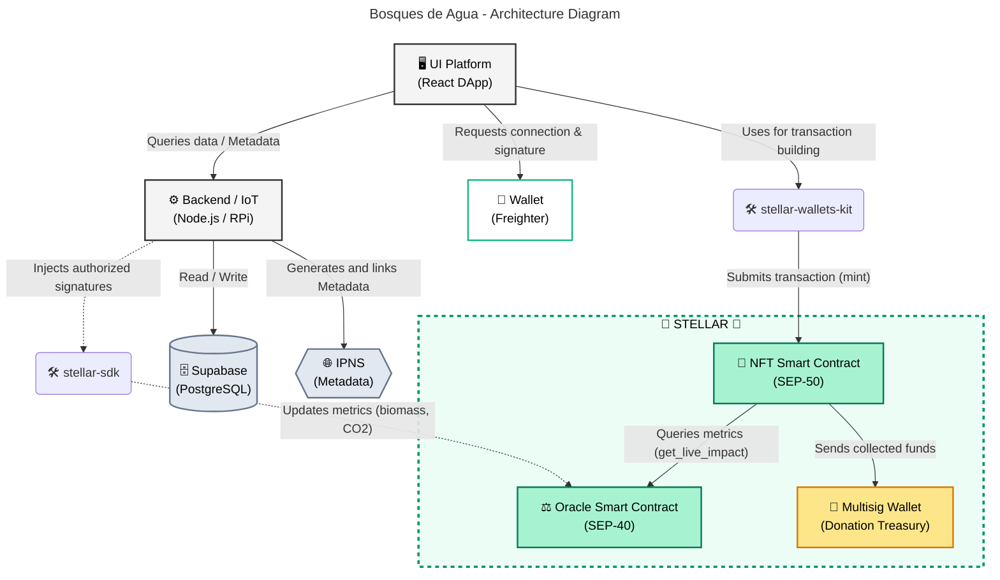

# 🌳 **Website** ⛰️: [BDA RWA Natural Resources](https://masch.github.io/bda-rwa-natural-resources)

# Bosques de Agua: Reforestation & Dynamic Impact Ecosystem

Bosques de Agua is a decentralized ecosystem built on **Stellar Soroban** to tokenize and monitor reforestation projects. By bridging real-world assets (RWA) with on-chain transparency, Bosques de Agua allows investors to own specific parcels of land while receiving real-time ecological data.

## 🏗 Architecture Overview

The system is designed with a **Modular Oracle-NFT Architecture** to handle dynamic environmental data efficiently:

1.  **Bosques de Agua Oracle (SEP-40)**: Acting as the single source of truth for environmental metrics. It receives data from IoT sensors (e.g., Raspberry Pi) and stores dynamic values like biomass, CO2 capture, and plant health.
2.  **Bosques de Agua NFT (SEP-50)**: Represents ownership of a specific reforestation parcel. Instead of relying on static metadata (SEP-11), it performs **Cross-Contract Calls** to the Oracle to provide live impact data.


## 🌟 Key Features
-   **Interactive Map Interface**: Visual frontend tracking parcels, dynamically loading geometries to allow direct geographical selection of real-world land.
-   **Dynamic Impact Tracking (Oracle)**: Real-time monitoring of biomass (grams), CO2 captured (milligrams), and plant health status via IoT endpoints.
-   **Cross-Contract Communication**: The SEP-50 NFT contract performs live cross-contract calls to the SEP-40 Oracle to fetch live metrics directly on-chain.
-   **Seamless Wallet Integration**: Users donate USDC securely to fractionalized parcels acting as a minting trigger, powered by `stellar-wallets-kit` and Freighter.
-   **Multisig Donation Treasury**: Inherent support for multisig collective wallets directly in the architecture to receive, secure, and distribute all incoming donations transparently.
-   **Multilingual Support & Leaderboards**: Fully internationalized (i18n) platform with English/Spanish switching and a global Top Donators chart.
-   **IoT-Native Security**: Restricted write access via `stellar-access` ensures only authorized sensor nodes can update the environmental Oracle metrics.


## 🗺️ Architecture Diagram


## 🛠 Project Structure

```text
contracts/
├── oracle/          # SEP-40 Oracle Implementation
│   ├── src/lib.rs   # Core logic for impact metrics & price feeds
│   └── Cargo.toml
└── nft/             # SEP-50 NFT Implementation
    ├── src/lib.rs   # Cross-contract logic & ownership management
    └── Cargo.toml
```

---

## 🚀 Getting Started

### Prerequisites

-   Rust & Cargo
-   [Stellar CLI](https://developers.stellar.org/docs/build/smart-contracts/getting-started/setup#install-the-stellar-cli)

### Build & Test

The project uses a root-level workspace for simplified management:

```bash
# Clone the repository
git clone https://github.com/Bosques de Agua/impacta.git
cd impacta/contracts

# Run comprehensive integration tests
make test

# Build all contracts (WASM)
make build
```

---

## 📊 Technical Specifications

### Impact Metrics (Oracle)
-   **Biomass**: `i128` (Grams)
-   **CO2 Captured**: `i128` (Milligrams)
-   **Health Status**: `Enum` (0: Germinating, 1: Sprouted, 2: Ready for Transplant, 3: Planted)

### Core Functions

| Contract | Function | Description |
| --- | --- | --- |
| **Oracle** | `update_impact_metrics` | Authorized node update for biomass, CO2, and health. |
| **Oracle** | `lastprice` | SEP-40 interface returning biomass. |
| **NFT** | `mint` | Creates a new parcel linked to geographical coordinates. |
| **NFT** | `get_live_impact` | **Cross-contract query** to fetch real-time data from the Oracle. |
| **NFT** | `geo_coordinates` | Retrieves physical parcel location. |

---

## 📄 License

This project is licensed under the MIT License.
